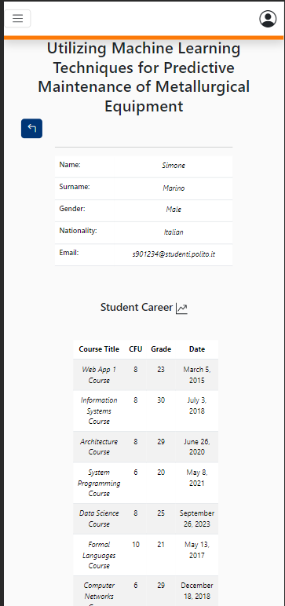

# Browse Application

This file contains a report about the FE testing on the ApplicationProfessor/BrowseForm component.

This manual testing will be done as the following:

- Screenshot of the form with wrong data highlighted
- Explanation of the procedure used for the test
- Screenshot of the result of the test
- Conclusions

# Authentication 

This component should be accessible only by logged professor so we are going to try to access it using both the teacher and student accounts. By trying to reach it it appears:

Depending on the type of user (teacher or student) two different components will be available (but the other one is part of another story).

# Functionality Testing

By opening the component we will be able to see something like that:

There a classification of the proposals depending on their state: 
- Pending
- Accepted
- Rejected

If the state doesn't contain anything there will be:

By clicking in "view applications" a list of students will appear:

By clicking one of these students a new page will appear:

Here we are able to see all the students info.
Depending on the state we are able to see buttons to accept/decline download, but this is part of another story.

# Mobile CSS Testing

In this part there's a test regarding the mobile part of the application into 3 devices:
- Galaxy Fold
- iPad Air
- iPhone 12

The CSS is responsive and it adapts in the different dimensions of the devices:

Galaxy Fold:

iPad Air:

iPhone 12:

