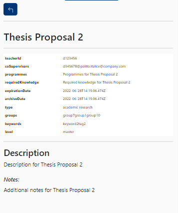

# Thesis Table Test

This file contains a report about the FE testing in the ThesisList component.

This manual testing will be done as the following:

- Explanation of the procedure used for the test
- Screenshot of the search bar with wrong data highlighted
- Screenshot of the result of the test
- Conclusions

# Functionality Testing

Data loading works and the student can see a table of proposals:

By clicking in one of the proposals there's a more complete description.

Inside the proposal there's a correct division of datas.
Here the student as the chance to apply by clicking the propriate button.
The CSS works as well as the mobile one (it has been tested by increasing and decreasing the dimension of the screen). 
By clicking the apply button there's a working redirection in the form in order to send the student application.
If the students wants to go back there's a specific button that sends back correctly in the table.

# Mobile CSS Testing

In this part there's a test regarding the mobile part of the application into 3 devicies:
- Galaxy Fold
- iPad Air
- iPhone 12

The CSS is responsive and it adapts in the different dimensions of the devices:

In the advanced research field the fields change their dimensions:

Original:

Mobile:

