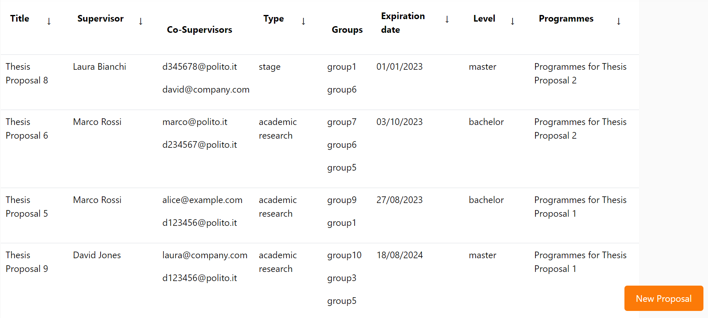
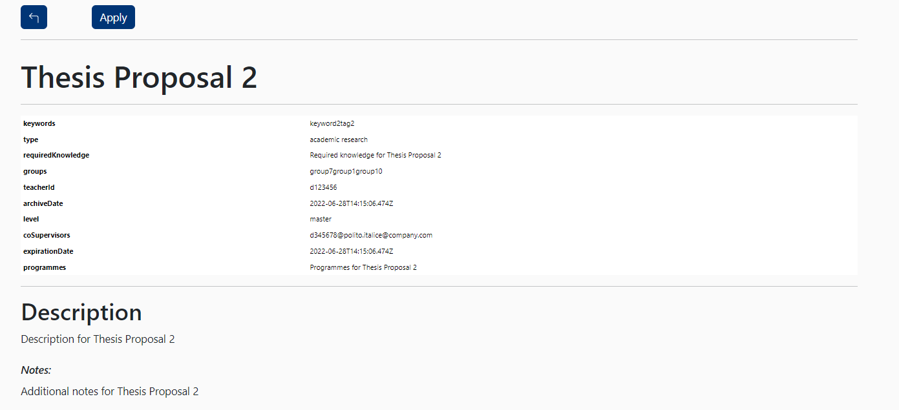
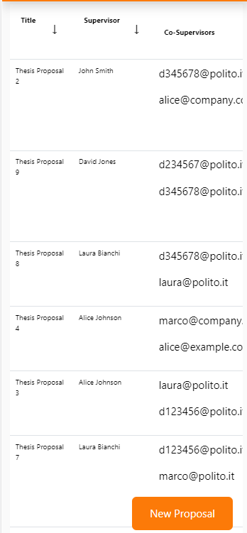
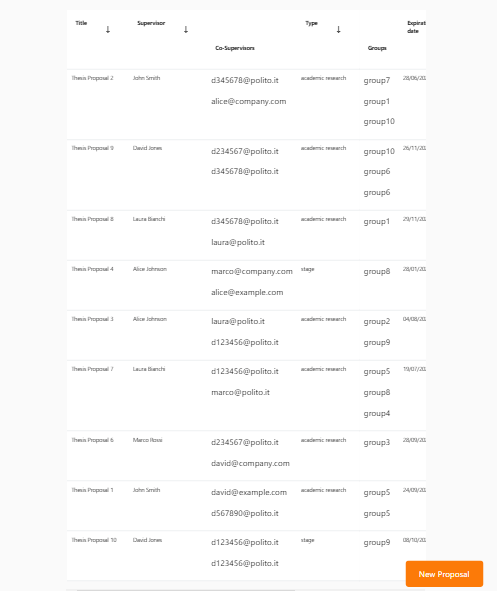
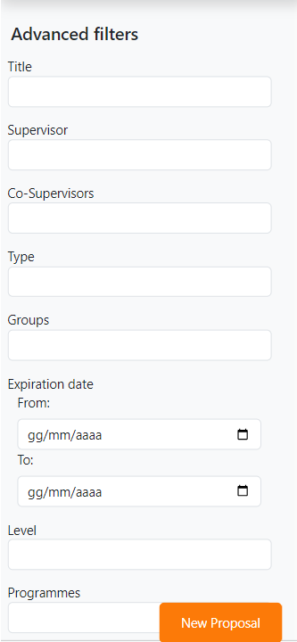

# Thesis Table Test

This file contains a report about the FE testing in the ThesisList component.

This manual testing will be done as the following:

- Explanation of the procedure used for the test
- Screenshot of the result of the test  
- Screenshot of the search bar with wrong data highlighted
- Conclusions

# Authentication 

This component should be accessible only by logged user so we are going to try to access it using both the teacher and student accounts. By trying to reach it it appears:

After the login we can proceed to test the functionality.

# Functionality Testing

Data loading works and the student can see a table of proposals:

By clicking in one of the proposals inside the table there's a more complete description.

Inside the proposal there's a correct division of data.
Here the student has the chance to apply by clicking the propriate button.
The CSS works as well as the mobile one (it has been tested by increasing and decreasing the dimension of the screen). 
By clicking the apply button (as a student) there's a working redirection in the form in order to send the student application.
If the students wants to go back there's a specific button that sends back correctly in the table.

# Search and Filtering

There's a chance to search with a propriate bar or by an advanced filter mode with a lot of fields.

If an advanced research is performed, the result appears correctly on the screen:

If something it's not present there is an appropriate message in the screen.

# Mobile CSS Testing

In this part there's a test regarding the mobile part of the application into 3 devicies:
- Galaxy Fold
- iPad Air
- iPhone 12

The CSS is responsive and it adapts in the different dimensions of the devices:

Galaxy Fold:

iPad Air:

iPhone 12:

In the advanced research field the fields change their dimensions in order to give a tidier display:

Original:

Mobile:

