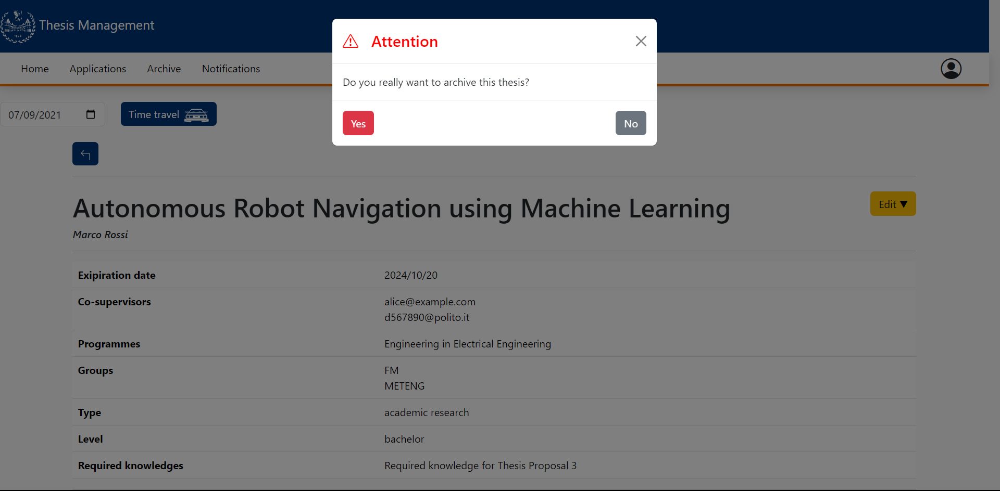

# Archive Proposal

This file contains a report about the FE testing on the insert proposal component.

This manual testing will be done as the following:

- Screenshot of the form with wrong data highlighted
- Explanation of the procedure used for the test
- Screenshot of the result of the test
- Conclusions

## Authentication

The insert proposal component should be accesible only by teachers so we are going to try to access it using both the teacher and student accounts.

The student view does not have the edit dropdown menu.

## Responsive Design

The CSS is responsive and it adapts in the different dimensions of the devices:

### iPhone

### iPad

## Functionality tests

The button should immediately archive the thesis and bring back to the list page where the thesis should not appear anymore.

### Before the archival

### Pressing of the button

### Attention popup

#### Desktop

#### Mobile

#### Tablet

### Done popup

#### Desktop

#### Mobile

#### Tablet

### After the archival

## COnclusions

The component works as expected and it is responsive.