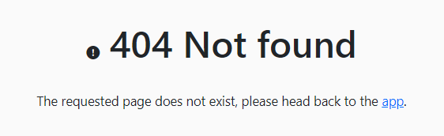

# Thesis Table Test

This file contains a report about the FE testing in the Archived Thesis component.

This manual testing will be done as the following:

- Explanation of the procedure used for the test
- Screenshot of the result of the test  
- Conclusions

# Authentication 

This component should be accessible only by logged teachers so we are going to try to access it using both the teacher and student accounts. By trying to reach it as students appears:

After the login we can proceed to test the functionality.

# Functionality Testing

Data loading works and the student can see a table of proposals:

By clicking in one of the proposals inside the table there's a more complete description.

Inside the proposal there's a correct division of data.
The CSS works as well as the mobile one (it has been tested by increasing and decreasing the dimension of the screen). 
If the students wants to go back there's a specific button that sends back correctly in the table.

The filtering option is exactly the same as the one from the thesisList component so it will not be tested.

# Mobile CSS Testing

In this part there's a test regarding the mobile part of the application into 3 devicies:
- Galaxy Fold
- iPad Air
- iPhone 12

The CSS is responsive and it adapts in the different dimensions of the devices:

Galaxy Fold:

iPad Air:

iPhone 12:

