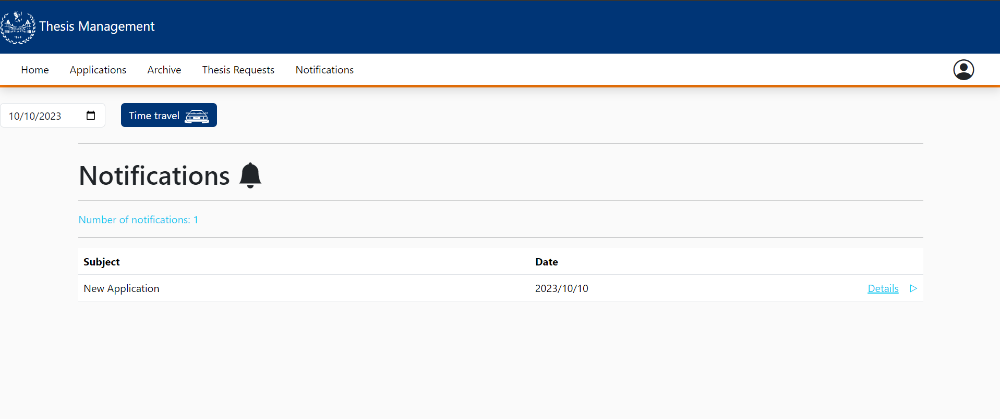
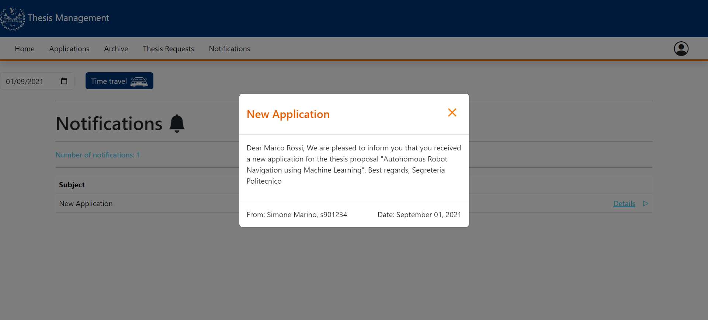
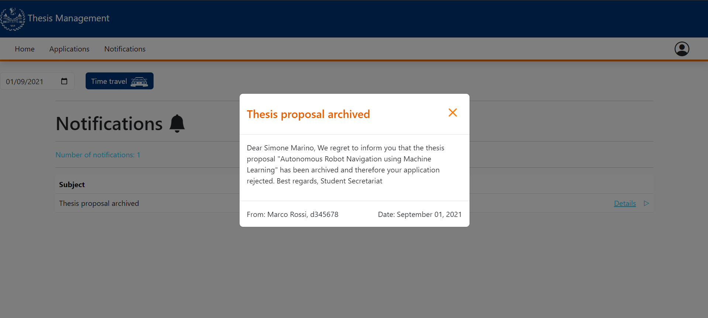
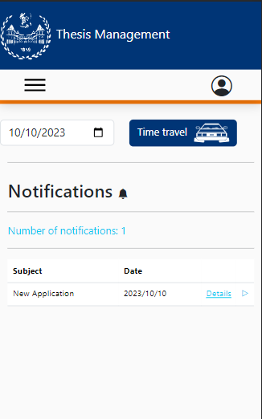
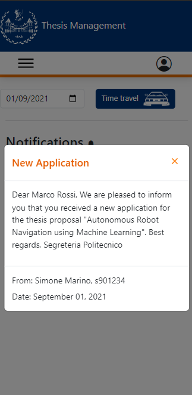
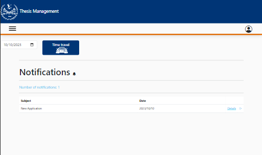
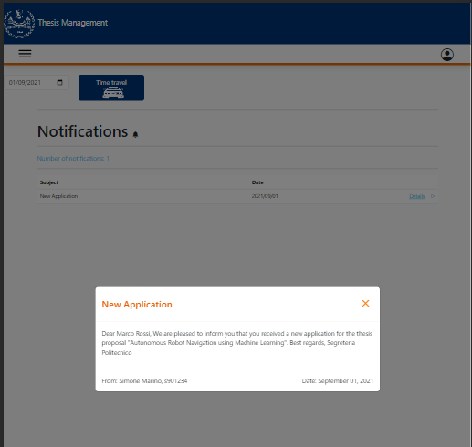
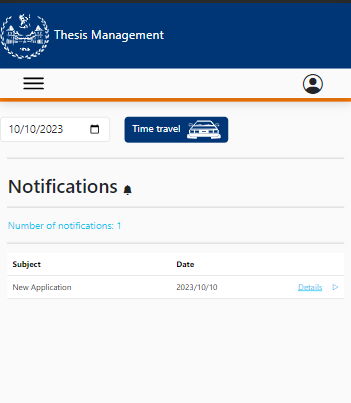
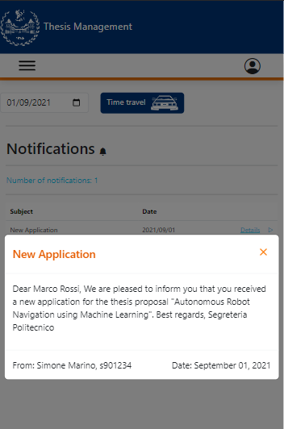

# Browse Notification

This file contains a report about the FE testing on the Browse Notification component.

This manual testing will be done as the following:

- Explanation of the procedure used for the test
- Screenshot of the result of the test

# Browse Notification View

The Browse Notification component is accessible both by teachers and students by clicking "Notifications" in the navbar.

Here, as it's shown in the page, there's a list of all the notifications:

When we click in one of the notifications a pop-up will appear:

In this pop-up are present all the info related to the notification.

Something similar happens also in student side:

# Mobile CSS Testing

In this part there's a test regarding the mobile part of the application into 3 devices:
- Galaxy Fold
- iPad Air
- iPhone 12

The CSS is responsive and it adapts in the different dimensions of the devices:

### Galaxy fold

### iPad Air

### iPhone 12

