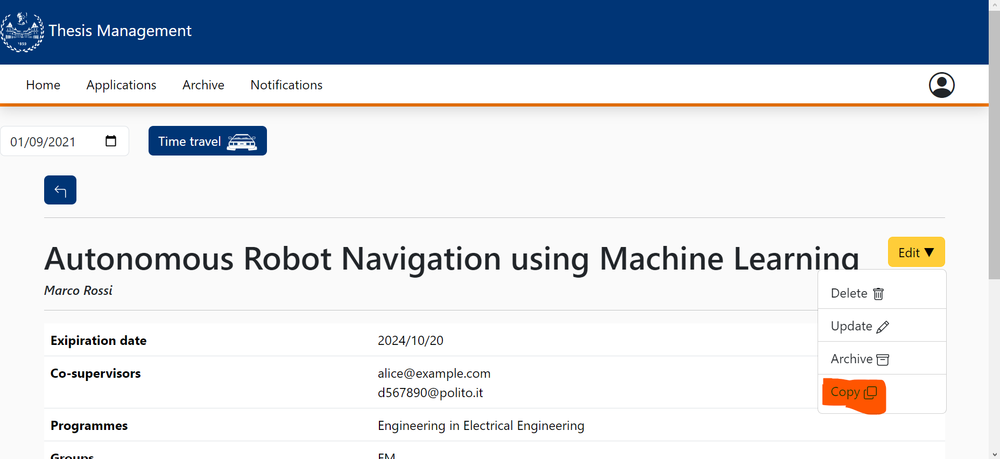
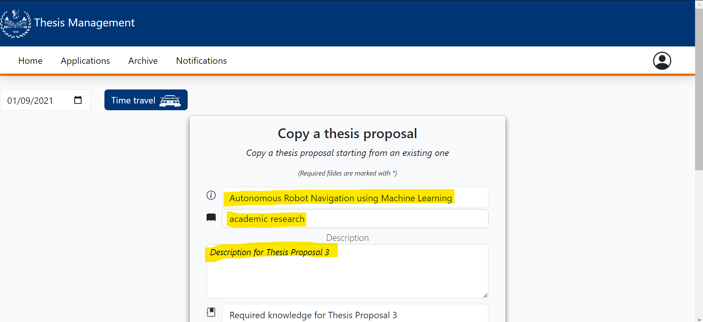
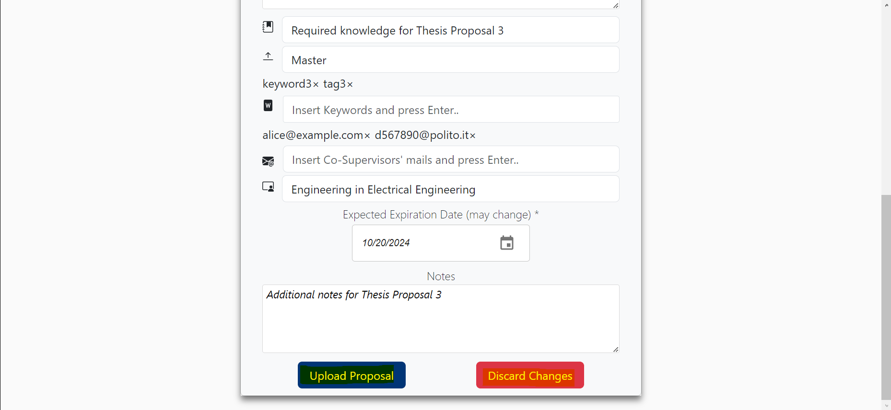
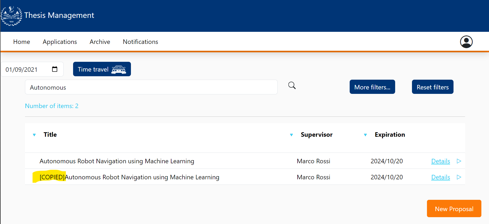
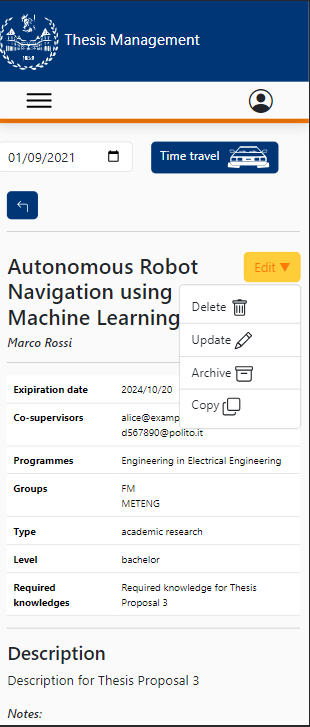
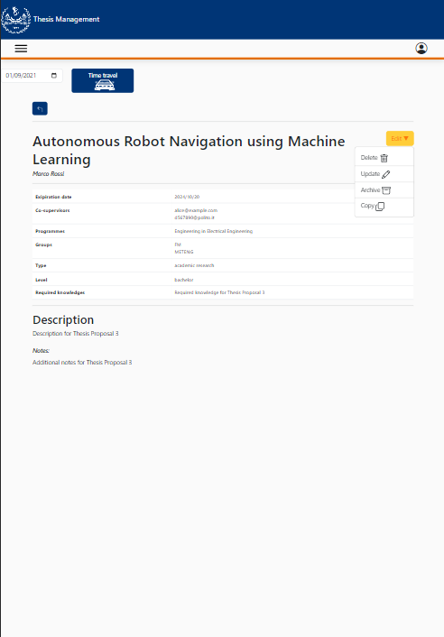
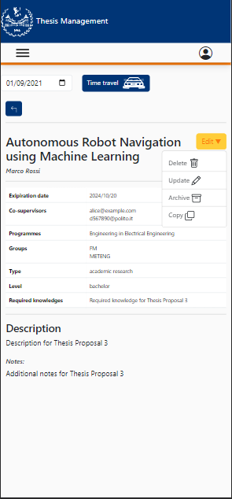

# Copy proposal

This file contains a report about the FE testing copy proposal component.

This manual testing will be done as the following:

- Explanation of the procedure used for the test
- Screenshot of the result of the test

# Teachers view

The copy proposal component should be accesible only by teachers. From an existing thesis proposal, a teacher should be able to copy the information for a new proposal

Results:

When logged into the teachers account we can a "Edit" menu in each thesis proposal details in which we can find the copy option 

When clicked, that option takes us to the standard new thesis form with the fields filled with the selected thesis details. All fields can be modified correctly.

Once reviewed or modified, we can discard the changes, bringing us back to the thesis details, or upload the new thesis proposal.

Once modified (We introduced **[COPIED]** in the beggining of the title)and uploaded, the new proposal is shown correctly in the thesis list.

# Mobile CSS Testing

In this test we are only testing the new "Edit" dropdown menu, as the form is the same component tested in previous iterations.
In this part there's a test regarding the mobile part of the application into 3 devices:
- Galaxy Fold
- iPad Air
- iPhone 12

The CSS is responsive and it adapts in the different dimensions of the devices:

### Galaxy fold

### iPad Air

### iPhone 12
