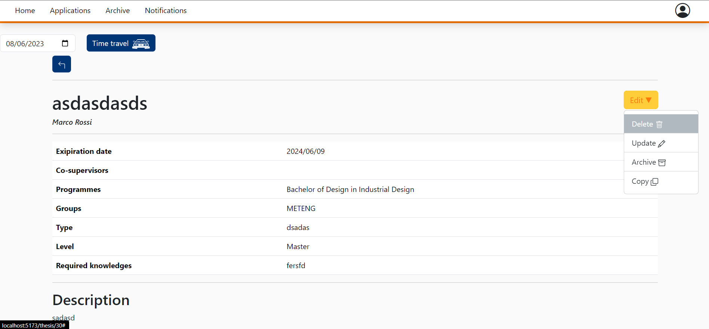
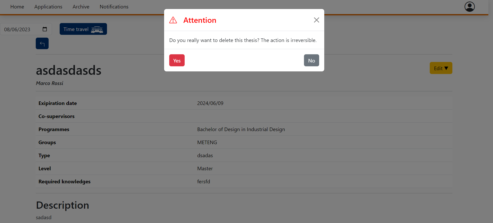
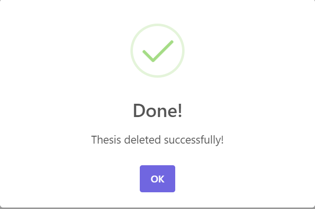
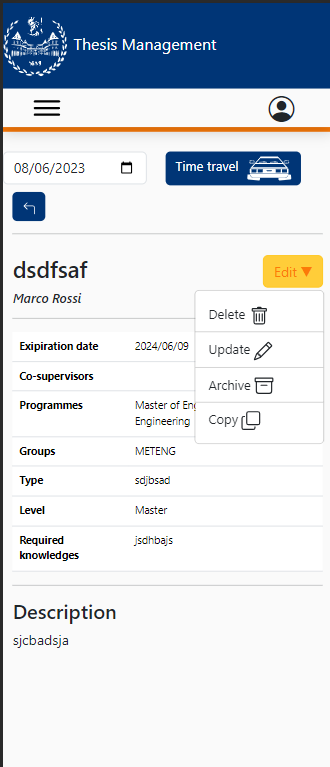
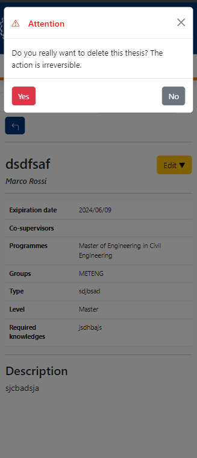
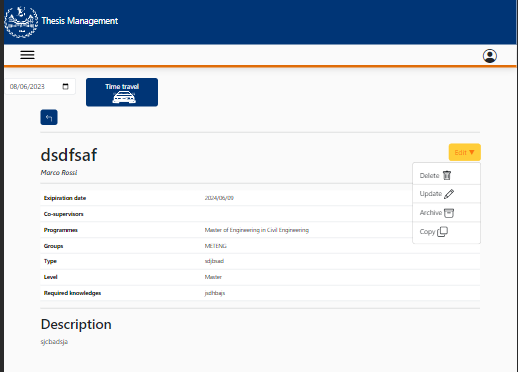
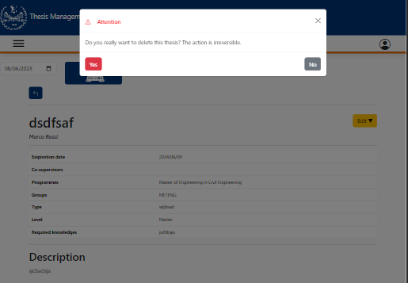
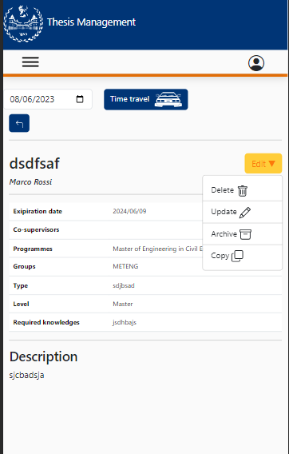
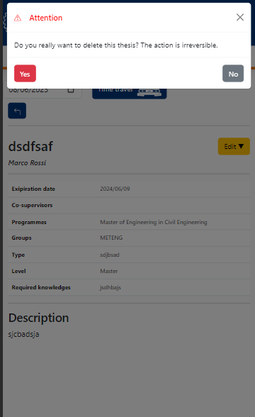

# Delete Proposal

This file contains a report about the FE testing on the delete proposal button.

This manual testing will be done as the following:

- Explanation of the procedure used for the test
- Screenshot of the data highlighted
- Screenshot of the result of the test
- Conclusions

# Functionality tests
### Deleting a thesis proposal: 

In order to delete a thesis proposal the user has to click in the edit button where a dropdown menu will appear. 

By clicking in the Delete field a message will appear:

And by clicking yes the proposal will be deleted and a message will appear:

Everything works as expected, the thesis proposal is deleted from the proposal table and from the DB too.

# Mobile CSS Testing

In this part there's a test regarding the mobile part of the application into 3 devices:
- Galaxy Fold
- iPad Air
- iPhone 12

The CSS is responsive and it adapts in the different dimensions of the devices:

# Galaxy Fold

# iPad Air

# iPhone 12

Everything works fine without graphical bugs.