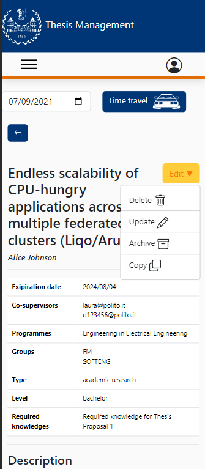

# Edit thesis proposal

This file contains a report about the FE manual testing on the procedure of editing an already-present thesis proposal.

# Teacher's Home page

The edit button component should be accesible only by teachers in their own thesis' details page. So, logging using valid theacher's credetial is mandatory.

Then, we click on the thesis we want to edit. 

## Thesis details

In the top-right corner we can see a combobox "edit" allowing to perform different action to the displayed thesis: click on update.

## Edit page

We are then displayed with a form allowing to modify all the details displayed in the previous page.

We can edit the description by typing "FE test".

## Saving changes

We just click on the corresponding button:

We are then back to the home page, and a success message is displayed. We can close it with a click on "Ok".
We can open again the thesis details page and check the modified description.

## Discard changes

We go again in the edit thesis page and we delete "FE test" from the description.
After that, we click on the "Discard changes"button, in the right-bottom corner. 

We are prompted out from the edit thesis page. We are automatically redirected to the thesis details page, where 
we can find the info unmodified.

# Mobile CSS Testing
The CSS is responsive and it adapts in the different dimensions of the devices:

### Galaxy fold

### iPad Air

