# Insert Student Request

This file contains a report about the FE testing on the Insert Student Request component.

This manual testing will be done as the following:

- Screenshot of the form with wrong data highlighted
- Explanation of the procedure used for the test
- Screenshot of the result of the test
- Conclusions

## Authentication

The insertion of a new student request is only available for authenticated students.

### Desktop

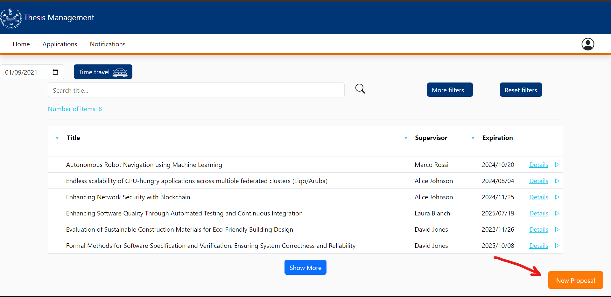

### Mobile

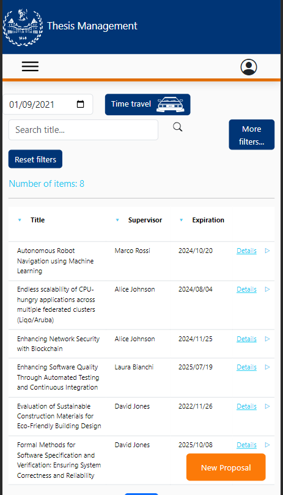

### Tablet 

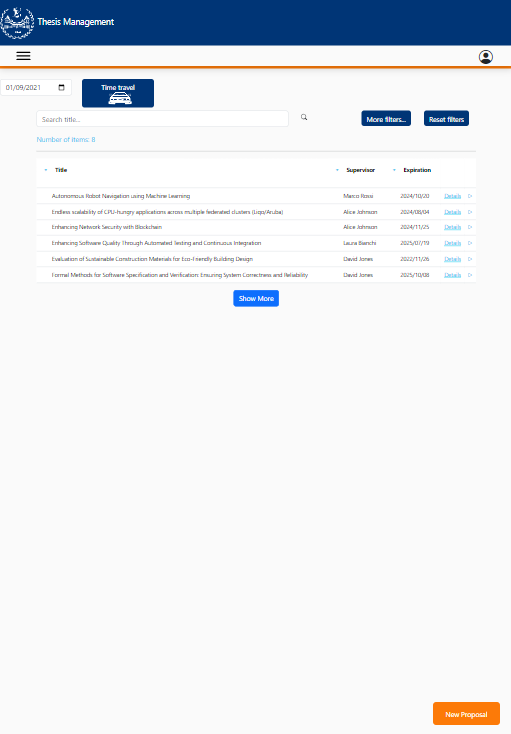

## Functionality tests

### Clicking on New Proposal 

In order to insert a new student thesis proposal the user has to click in the "new proposal" button where a form will appear. 

#### Desktop

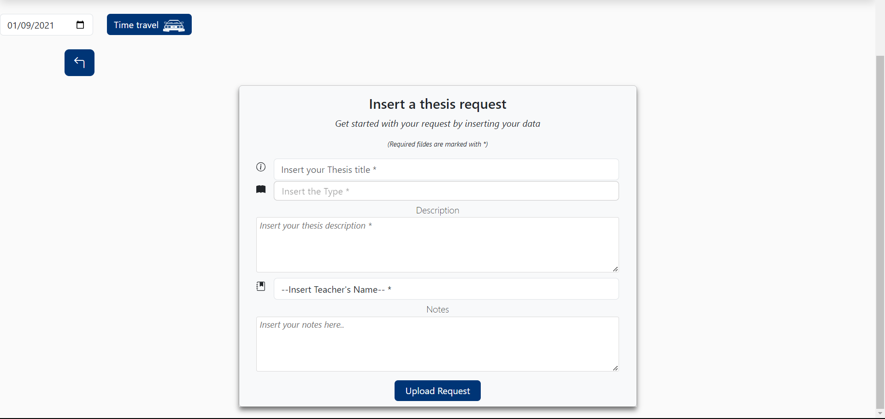

#### Mobile

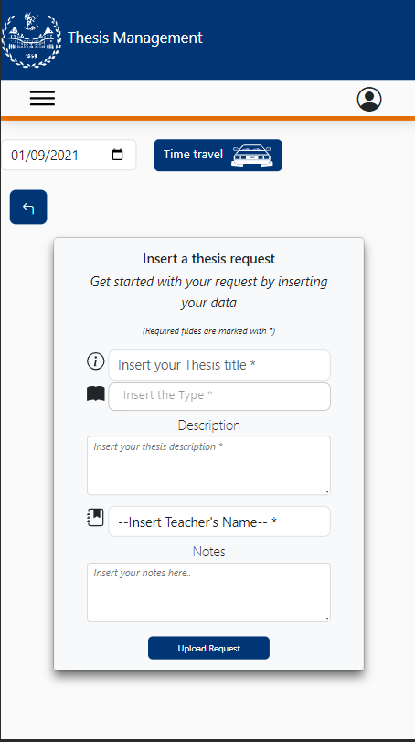

#### Tablet

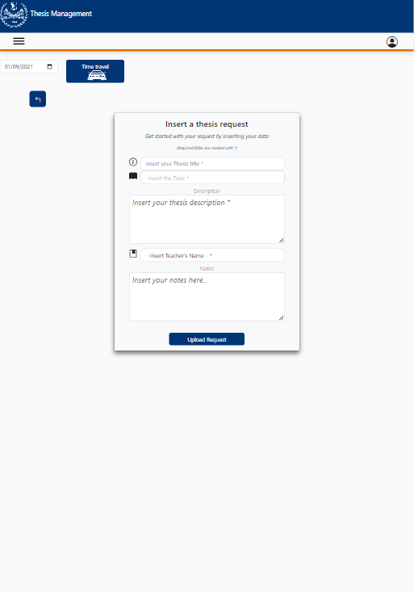

### Clicking on Upload Request without filling the form

If a student forgots to fill the form and clicks on the "upload request" button, the form will be highlighted in red and the user will be notified that the form is not filled correctly.

#### Desktop

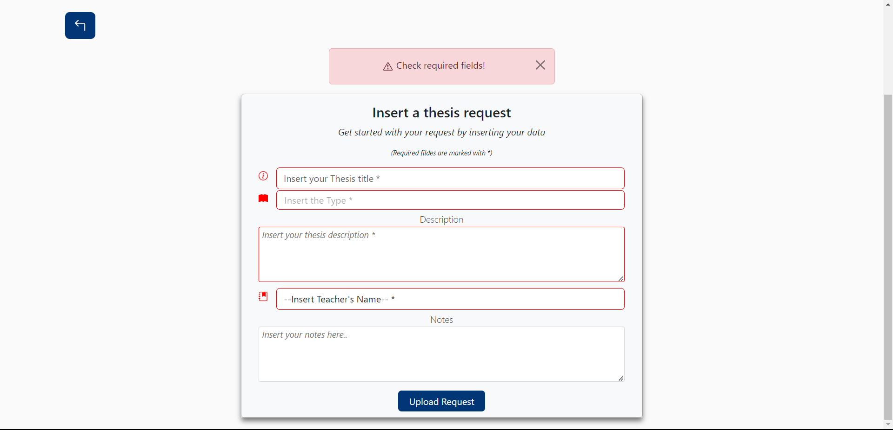

#### Mobile

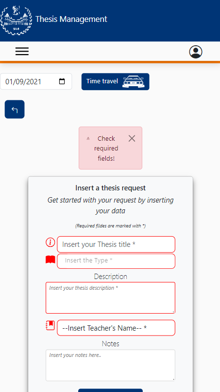

#### Tablet

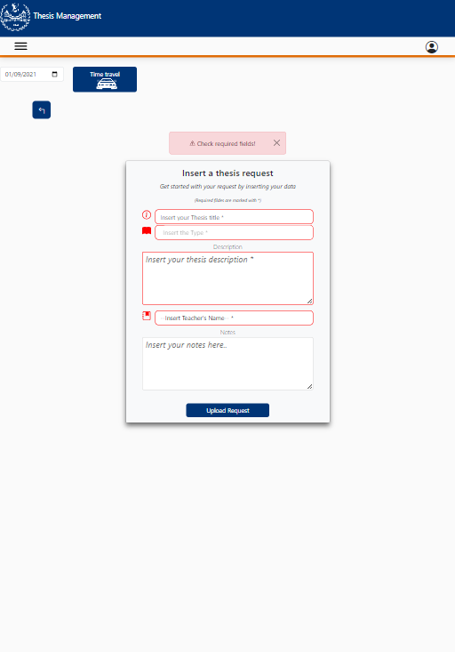

### Clicling on Upload Request with the form filled correctly

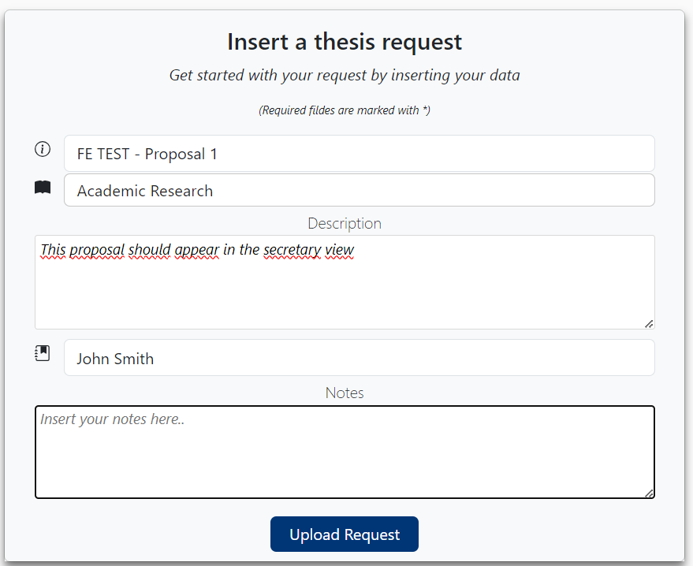

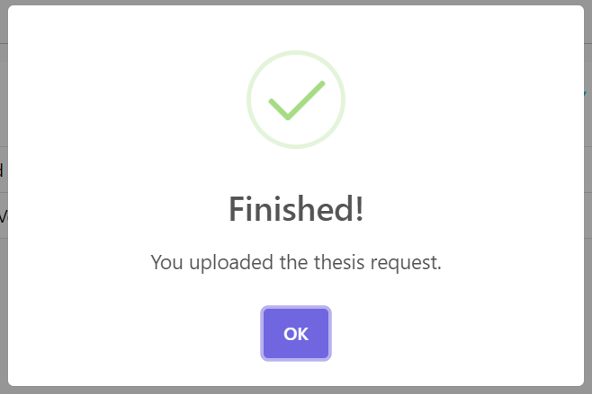

Secretary view:

#### Desktop

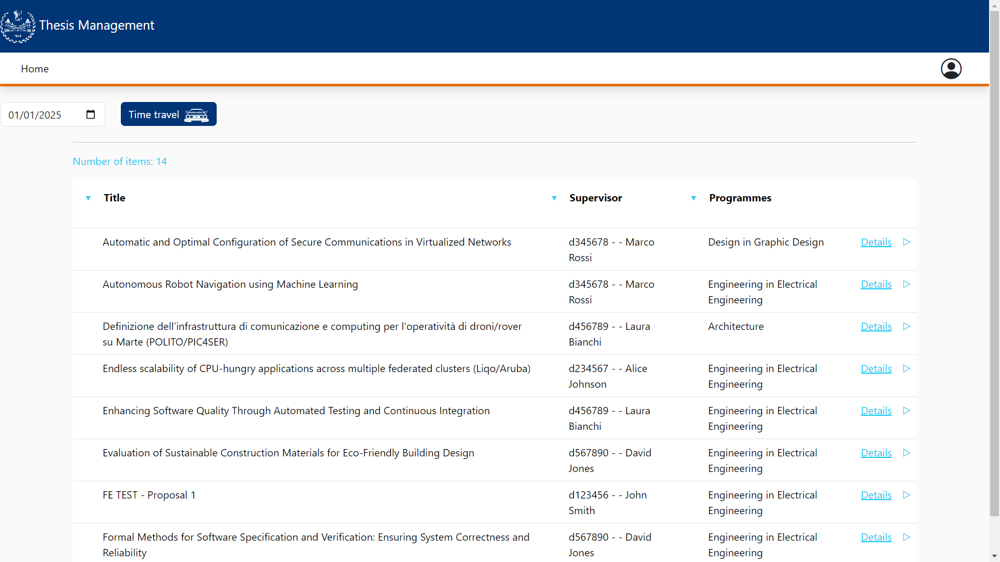

#### Mobile

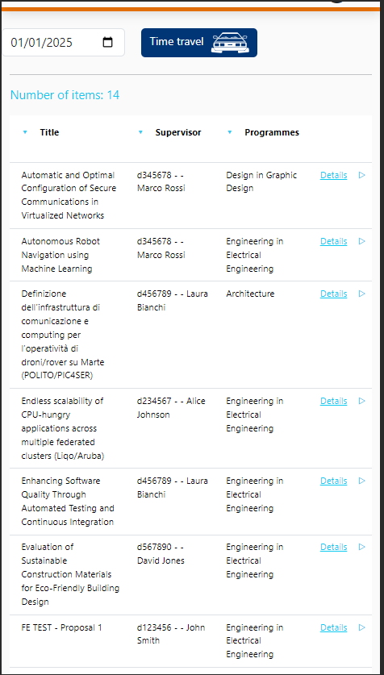

#### Tablet

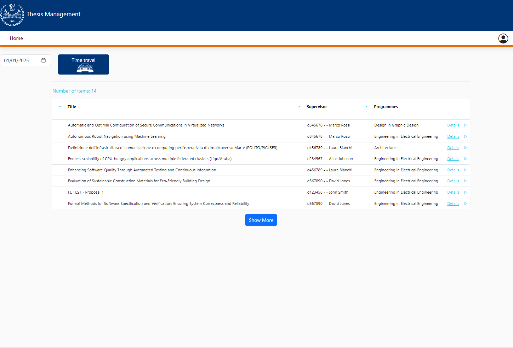

## Conclusions

The Insert Student Request component works as expected. The form is validated correctly and the user is notified if the form is not filled correctly. The form is responsive and works correctly in all the devices. 