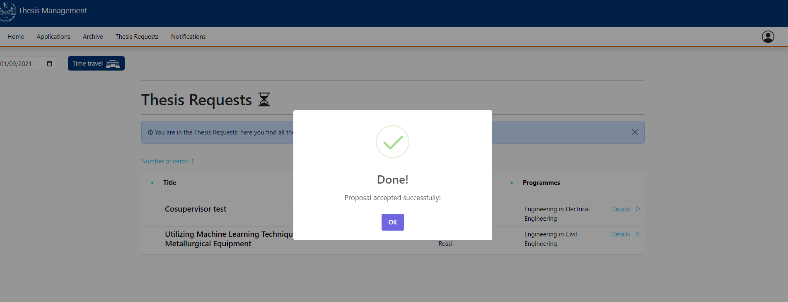
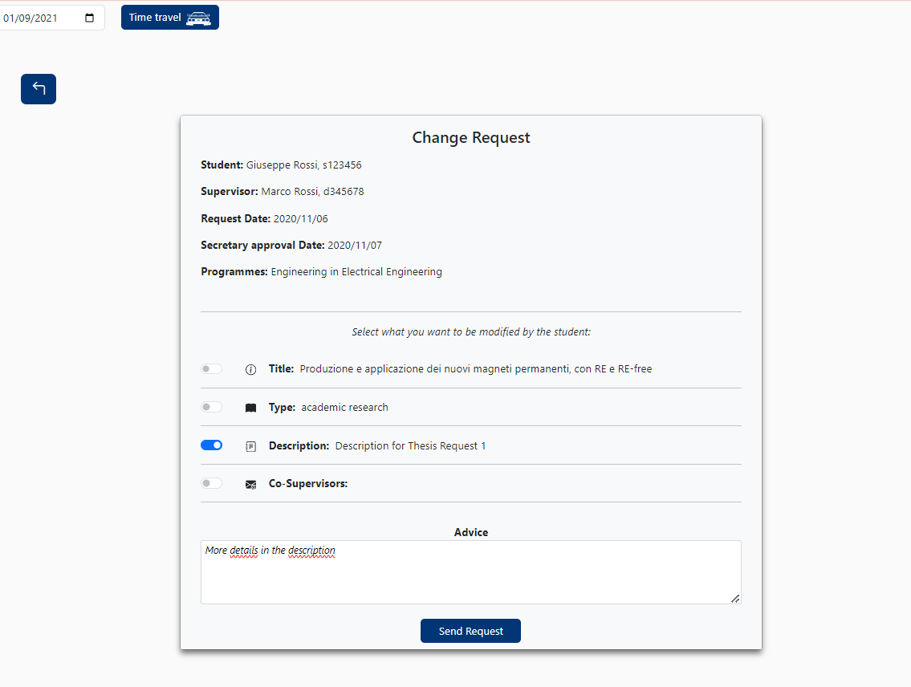
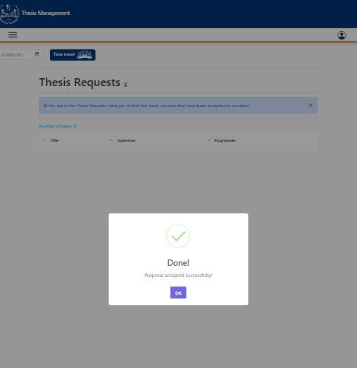

# Edit thesis proposal

This file contains a report about the FE manual testing on the procedure of accepting/rejecting a start thesis requestmade by a student to a professor.

# Teacher's Home page

The edit button component should be accesible only by teachers in their own thesis request page. So, logging using valid theacher's credetial is mandatory.
We click on the tab "Thesis Requests", which can be found in the navbar.
If there are some pending requests, a list is displayed:

## Details page

Then, we click on a particular request: the details page is displayed

## ACCEPT

In the bottom right corner we can see the button for accepting. We click on it:

We can see as the thesis request is no more in the list.

## REJECT

In the bottom right corner we can see the button for rejecting (named "decline"). We click on it:

We can see as the thesis request is no more in the list.

## REQUEST SOME UPDATES

In the top right corner, we click on "Change request" button.
We are then displayed a form were we can:
- Select the fields we want the student to change, by toggling the switches on the right;
- Add an additional comment, by writing in the textinput at the bottom;

Then, we click on "Send request" button: we are displayed a success alert.

# Mobile CSS Testing
The CSS is responsive and it adapts in the different dimensions of the devices:

### GalaxyS8

### iPad Air

