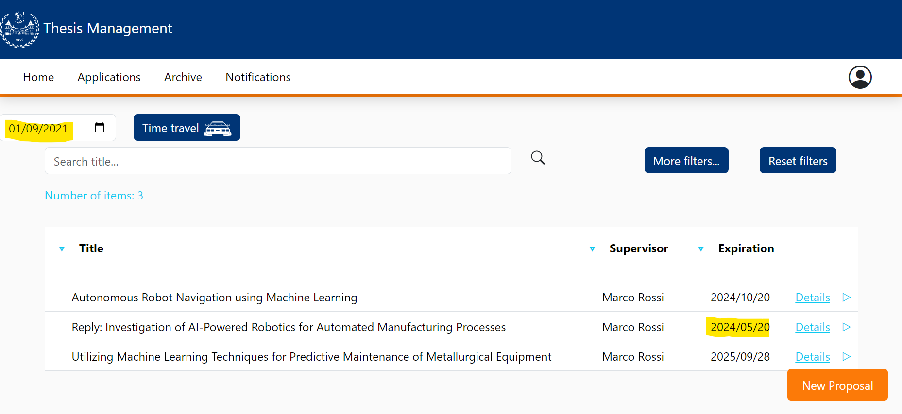
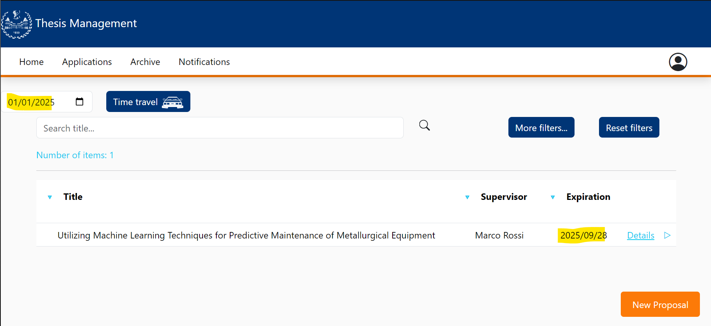

# Thesis Expiration Test

This file contains a report about the FE testing in the thesis expiration.

This manual testing will be done as the following:

- Explanation of the procedure used for the test
- Screenshot of the result of the test  

# Test using virtual clock

We are going to use the virtual clock to test if the thesis expire and dissapear from the thesis list according to their expiration date.

These are the thesis proposed by Marco Rossi: 

After we change the date in the virtual clock, the thesis with expiration date prior to the new virtual date are not shown anymore.

