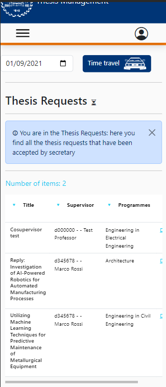

# Thesis Request Details

This file contains a report about the FE testing on the Thesis Request component.

This manual testing will be done as the following:

- Explanation of the procedure used for the test
- Screenshot of the result of the test

# Thesis Requests View

The Thesis Requests component should be accessible only by teachers.

Here, as it's shown in the page, there's a list of all the thesis requests accepted by secretary.

When we click in one of the thesis requests we are able to see the details:

Here the professor is able to see all the info required and he has the change to accept or decline by clicking the buttons in the bottom of the page.

# Mobile CSS Testing

In this part there's a test regarding the mobile part of the application into 3 devices:
- Galaxy Fold
- iPad Air
- iPhone 12

The CSS is responsive and it adapts in the different dimensions of the devices:

### Galaxy fold

### iPad Air

### iPhone 12

