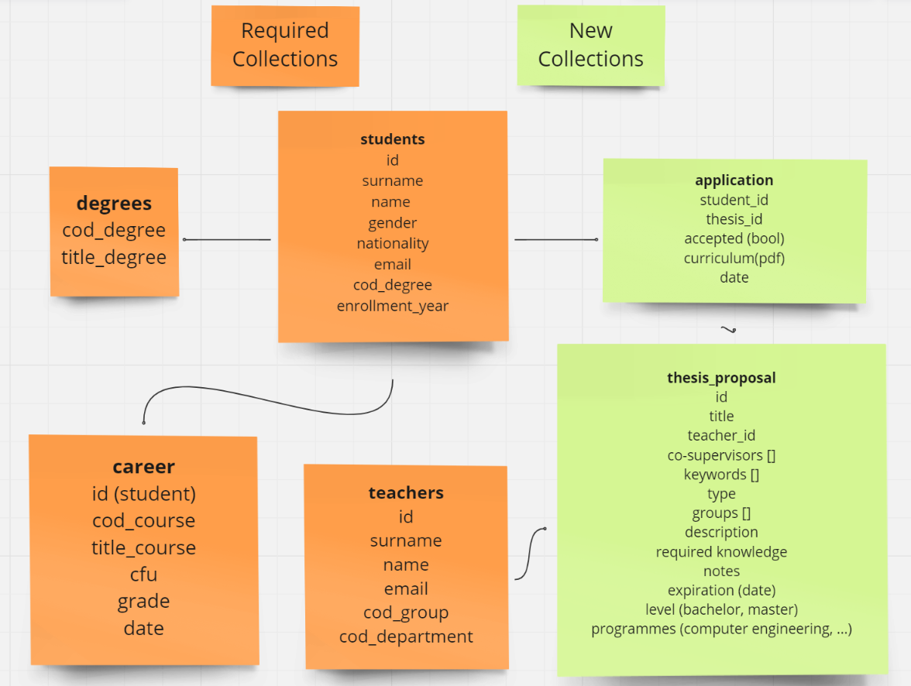
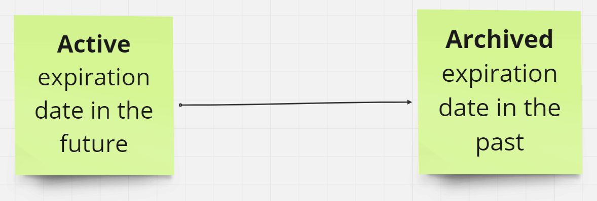

# Collections

## Predefined collections

### Degrees

The programme the student is studying in. The degree is connected to the student via the cod_degree.

### students

### career

- grade: contains a number between 18 and 30 or a string '30L' that sould be considered in case we want to do an average.

### teachers

## Added collections

### applications

Connects students with the thesis they are applying for. It also contains a fields for the curriculum vitae that is a reference to a Cloud Storage file.

### thesis_proposal

The thesis is connected to the teacher via the teacher_id. The teacher is of course the supervisor of the thesis. 

- **co-supervisors**: Array of strings with the emails of the co-supervisors, both academic and non-academic. 
- **groups**: Array of strings with the cod_group of all the groups the thesis belongs to. We consider that the database of Politecnico has a group table.
- **expiration**: the date of expiration of a thesis. To archive a thesis we just set the expiration date to yesterday and it will be automatically archived by the system. In this way we can easily use the virtual clock to show the thesis that were still active.